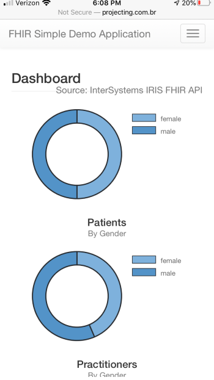

# FHIR Simple Demo Application
This project illustrates the use of InterSystems IRIS FHIR as a service.

## Demo
A live demo is available here: http://projecting.com.br/isc14/

## Features
* Dashboard Components
  * Charts
  * Scores
  * Lists
* Responsible Tables
  * Pagination
  * Sortable Fields
  * Searchable Fields
  * Reference Fields
* Responsive Forms
  * Related Resources
* Authorization
  * API key
* Mobile Support

## Dependencies
* AngularJS 1.5.11
* Bootstrap 3.3.7

## Screenshots
Dashboard Page

<kbd></kbd>

Table Page

<kbd></kbd>

Form Page

<kbd></kbd>

Mobile Support

<kbd></kbd>

## Installation Steps

1. Download the code to your local disk
```
git clone --depth=1 https://github.com/Sirotheau/isc_contest_14.git
```
2. Upload all the files to a web server
3. Configure the initial page to "index.html"

## OIDC Notes
The current DEMO cannot be used to test the OIDC demo page as it currently does not have a valid SSL Certificate. The OIDC specification requires that the communication must utilize TLS. If testing in your own web server, ensure that the callback endpoint is properly configured to point to https://{your-web-server}/oauth_callback.html.

If properly configured, you should be able to see both the Access and ID Tokens. This is only a simple demo application, but in an actual implementation the ID token is used to authenticate and authorize users to your application. Remember to also validate the ID Token against the OIDC specification.

As a final note, ensure the tokens above were properly signed by the OIDC Provider. You can use the OIDC Provider JSON Web Key Set to validate the signatures. It is usually listed by the OIDP Discovery Service under the metadata "jwks_uri".

## Future Enhancements
* Export Capabilities
* On Demand Reporting
* API Side Pagination
* Other Resources
* Upgrade to latest version of Angular
* Upgrade to latest version of Bootstrap
