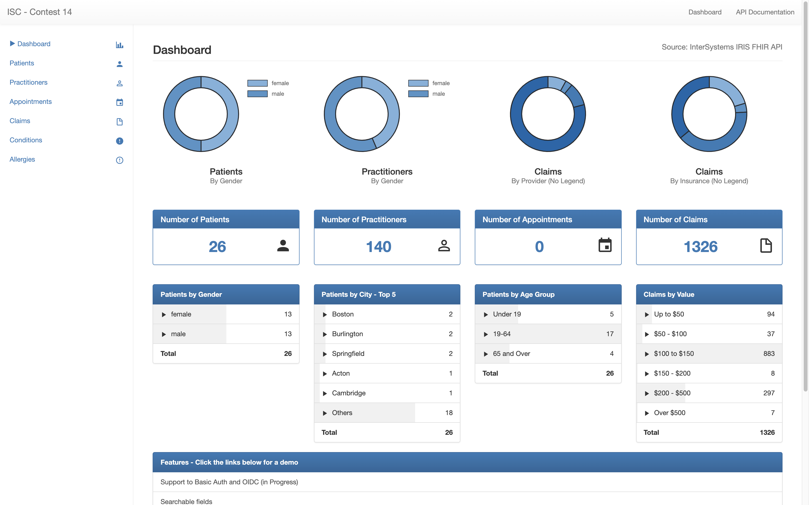
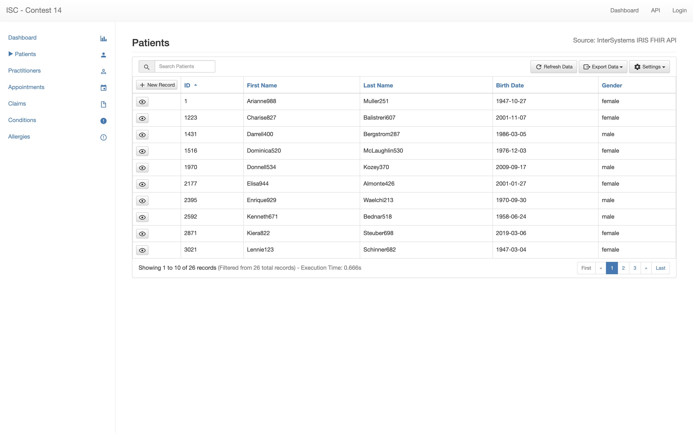
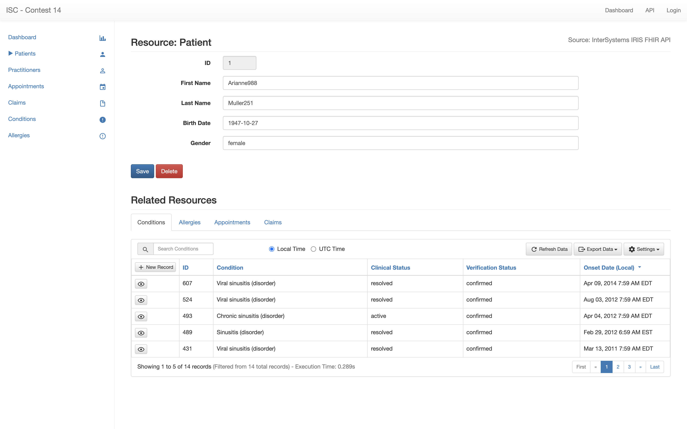

# FHIR Simple Demo Application
This project illustrates the use of InterSystems IRIS FHIR as a service.

## Demo
A live demo is available here: http://projecting.com.br/isc14/

## Features
* Dashboard Components
  * Charts
  * Scores
  * Lists
* Responsible Tables
  * Pagination
  * Sortable Fields
  * Searchable Fields
  * Reference Fields
* Responsive Forms
  * Related Resources
* Authorization
  * API key
  * OIDC

## Dependencies
* AngularJS 1.5
* Bootstrap 3.3

## Screenshots
Dashboard Page

Table Page

Form Page

## Installation Steps

1. Download the code to your local disk using `git clone https://github.com/Sirotheau/isc_contest_14.git`
1. Upload all the files to a web server
1. Configure the initial page to "index.html"

## Future Enhancements
* Export Capabilities
* On Demand Reporting
* API Side Pagination
* Upgrade to latest version of Angular
* Upgrade to latest version of Bootstrap
